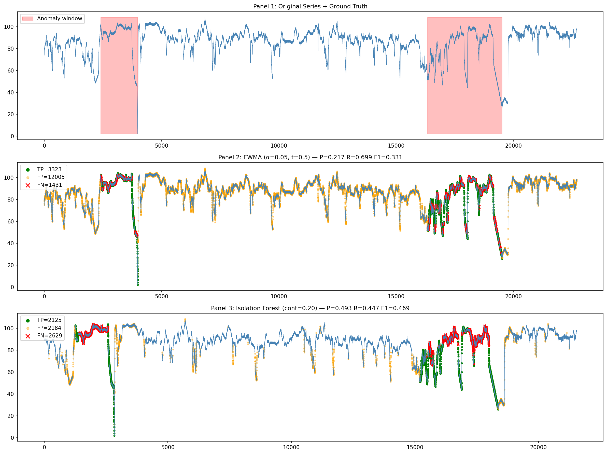

# W1-D1 Assignment Submission
**Dataset:** realKnownCause/machine_temperature_system_failure.csv  
**Name:** Nguyễn Trần Huy Vũ  

---

## 1. Screenshots

### Plot kết quả 2 detector

### Bảng so sánh
| Metric       | EWMA (a=0.05, t=0.5) | Isolation Forest (cont=0.20) |
|--------------|----------------------|------------------------------|
| Precision    | 0.217                | 0.493                        |
| Recall       | 0.699                | 0.447                        |
| F1           | 0.331                | 0.469                        |
| False Alarms | 12005                | 2184                         |
| Miss (FN)    | 1431                 | 2629                         |

---

## 2. Tuning Log

### Detector 1 — IQR Rolling (bị loại sau tuning)
| window | hours | Precision | Recall | F1    | Ghi chú |
|--------|-------|-----------|--------|-------|---------|
| 288    | 24h   | 0.258     | 0.129  | 0.172 | band drift theo trend |
| 1440   | 120h  | 0.354     | 0.112  | 0.170 | sustained shift không phải spike |
| 2880   | 240h  | 0.158     | 0.033  | 0.054 | window quá lớn, miss hết |

**Kết luận:** IQR fail vì anomaly là sustained shift 5-11 ngày,
không phải spike ngắn. Switch sang EWMA.

### Detector 1 — EWMA tune threshold
| alpha | threshold | Precision | Recall | F1    | Ghi chú |
|-------|-----------|-----------|--------|-------|---------|
| 0.05  | 3.0       | 0.500     | 0.001  | 0.002 | threshold quá cao, gần như không detect |
| 0.05  | 1.0       | 0.207     | 0.323  | 0.252 | balance hơn nhưng recall thấp |
| 0.05  | 0.5       | 0.217     | 0.699  | 0.331 | ← BEST: recall cao nhất |
| 0.1   | 0.5       | 0.211     | 0.679  | 0.322 | alpha cao hơn, recall thấp hơn chút |

**Best:** alpha=0.05, threshold=0.5 → Recall=0.699

### Detector 2 — Isolation Forest tune contamination
| contamination | Precision | Recall | F1    | Ghi chú |
|---------------|-----------|--------|-------|---------|
| 0.15          | 0.502     | 0.341  | 0.406 | recall thấp |
| 0.20          | 0.493     | 0.447  | 0.469 | ← BEST: F1 cao nhất |
| 0.25          | 0.435     | 0.493  | 0.462 | recall tăng nhưng precision drop |

**Best:** contamination=0.20 → F1=0.469

---

## 3. Model Artifacts

- `isolation_forest.joblib` — Isolation Forest trained model
  - contamination=0.20, n_estimators=200, random_state=42
  - Features: value, rolling_mean, rolling_std, rolling_mean_4h,
    rate_of_change, rate_of_change_5, lag_1, lag_288, z_score
  - Training size: 21544 samples × 9 features

---

## 4. Reflection

### Data type
| Property    | Kết quả                                        |
|-------------|------------------------------------------------|
| Granularity | 5 phút                                         |
| Stationary  | KHÔNG — strong trend (ACF giảm đều đến lag=288)|
| Seasonal    | KHÔNG — không có peak ở lag=288 hay lag=2016   |
| Skewness    | +1.834 → heavily right-skewed                  |
| Log transform| Overcorrect (-3.130) → không dùng             |
| Anomaly type| Sustained shift dài 5-11 ngày (20.95% data)   |

### Method choice
**Detector 1: EWMA (alpha=0.05, threshold=0.5)**

IQR bị loại vì anomaly là sustained shift, không phải spike —
IQR chỉ detect điểm lạ đơn lẻ, không detect vùng drift kéo dài.
Log transform bị loại vì overcorrect skewness từ +1.834 → -3.130.
EWMA được chọn vì nhớ baseline lịch sử xa, detect khi data drift
quá xa khỏi expected value tích lũy.

**Detector 2: Isolation Forest (contamination=0.20)**

Contamination=0.20 (không phải default 0.01-0.05) vì anomaly
rate thực tế là 20.95% — phải tune theo data, không dùng default.
9 features mang temporal context vào model: rolling stats, lag,
rate of change — IF cần features này vì nó không hiểu time order.

### Detector nào tốt hơn?
**Isolation Forest tốt hơn** cho production (F1=0.469 > 0.331).

EWMA có Recall cao hơn (0.699 vs 0.447) nhưng FP=12005 —
on-call nhận 12005 false alarm, dẫn đến alert fatigue và bắt
đầu ignore alert. Đây là failure mode nguy hiểm trong production.

IF có Precision=0.493, FP=2184 — 5.5x ít false alarm hơn,
on-call tin tưởng alert hơn.

### Trade-off
| | EWMA | Isolation Forest |
|---|---|---|
| Ưu | Recall cao, không bỏ sót | Precision cao, ít false alarm |
| Nhược | FP=12005, alert fatigue | FN=2629, miss sustained anomaly |
| Dùng khi | Critical system, không được miss | Production, cần alert quality |

### Production choice
**Pipeline kết hợp:**
1. EWMA (recall cao) → first pass, bắt rộng

2. Isolation Forest (precision cao) → second pass, filter false alarm

3. Page on-call chỉ khi cả 2 đều agree