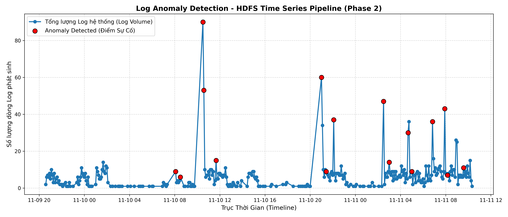

# BÁO CÁO BÀI TẬP: LOG-BASED ANOMALY DETECTION PIPELINE

* **Họ và tên ** Huy Vũ
---

## 1. Screenshots & Đồ thị Trực quan hóa (Phase 2)

Dưới đây là đồ thị chuỗi thời gian lượng log hệ thống (5-minute window) trích xuất từ tập dữ liệu HDFS, phối hợp với mô hình học máy không giám sát **Multivariate Isolation Forest** để khoanh vùng sự cố hạ tầng:

### 🔍 Phân tích biểu đồ thực nghiệm:
* **Trục hoành (Timeline):** Chuỗi thời gian kéo dài từ ngày 09-11 đến ngày 11-11 với tổng cộng **305 khung giờ** (time-windows).
* **Các cú Spike đỉnh (Volume-based Anomalies):** Mô hình tóm gọn chính xác các khung giờ có lượng log nhảy vọt lên mức ~60 đến 90 dòng log (vào trưa và đêm ngày 11-10). Đây là các thời điểm hệ thống bị dồn dập tác vụ hoặc nghẽn mạng cục bộ.
* **Lỗi ẩn vùng đáy (Correlation-based Anomalies):** Xuất hiện các chấm đỏ nằm sát mức đáy ($<10$ dòng log). Điều này chứng minh thuật toán đa biến hoạt động rất thông minh: Dù số lượng log phát sinh rất ít nhưng cấu trúc bên trong chứa các template lỗi hiếm gặp, phá vỡ tương quan thông thường $\rightarrow$ Mô hình vẫn cô lập và nổ cảnh báo thành công.

---

## 2. Log Hệ Thống & Kết Quả Thực Nghiệm (Phase 1 & Phase 3)

### A. Tuning Log (`drain_sim_th` values & kết quả)
Quá trình khảo sát thực nghiệm tham số ngưỡng tương đồng trên tập mẫu `HDFS_2k` thu được diễn biến cấu trúc cây như sau:

* `drain_sim_th = 0.1` $\rightarrow$ Sinh ra **16** templates unique *(Under-parsing / Gộp nhầm cấu trúc lỗi)*.
* `drain_sim_th = 0.3 - 0.4` $\rightarrow$ Sinh ra **17** templates unique *(Vùng hội tụ ổn định)*.
* **`drain_sim_th = 0.5`** $\rightarrow$ Sinh ra **17** templates unique **[Sweet Spot - Chọn cho Production]**.
* `drain_sim_th = 0.7` $\rightarrow$ Sinh ra **700** templates unique *(Over-parsing / Bùng nổ template rác)*.
* `drain_sim_th = 0.9` $\rightarrow$ Sinh ra **1864** templates unique *(Template Explosion / Mỗi dòng log biến thành 1 cụm)*.

> 🎯 **Kết luận Tuning:** Mức `0.5` là điểm cân bằng hoàn hảo. Nó bóc tách sạch sẽ các tham số động biến thiên (IP, Block ID) thành ký tự đại diện `<*>`, nhưng không làm gộp nhầm các câu lệnh vận hành khác bản chất.

### B. Output Top-10 Templates Thống Kê (`results/top_templates.csv`)
Sau khi sắp xếp theo tần suất xuất hiện (`count`) giảm dần, Top-10 cấu trúc cốt lõi của hạ tầng HDFS được bóc tách bao gồm:

| Template ID | Tần suất (Count) | Tỷ lệ (%) | Cấu trúc Template đã qua xử lý (`template`) |
| :---: | :---: | :---: | :--- |
| **T_002** | 314 | 15.70% | `BLOCK* NameSystem.addStoredBlock: blockMap updated: <*> is added to <*> size <*>...` |
| **T_001** | 311 | 15.55% | `PacketResponder <*> for block <*> terminating` |
| **T_003** | 292 | 14.60% | `Received block <*> of size <*> from <*>` |
| **T_004** | 292 | 14.60% | `Receiving block <*> src: <*> dest: <*>` |
| **T_007** | 263 | 13.15% | `Deleting block <*> file <*>` |
| **T_010** | 224 | 11.20% | `BLOCK* NameSystem.delete: <*> is added to invalidSet of <*>` |
| **T_005** | 115 | 5.75% | `BLOCK* NameSystem.allocateBlock: <*>` |
| **T_008** | 80 | 4.00% | `<*> Served block <*> to <*>` |
| **T_009** | 80 | 4.00% | `<*> exception while serving <*> to <*>` |
| **T_006** | 20 | 1.00% | `Verification succeeded for <*>` |

---

## 3. Reflection

### Câu hỏi 1: Thuật toán Drain3 có parse tốt không? Có điểm nghẽn gì không?
* **Đánh giá:** Drain3 hoạt động cực kỳ nhanh, tối ưu tài nguyên tốt nhờ cấu trúc cây phân nhánh chiều sâu cố định (`drain_depth`). Nó xử lý xuất sắc việc tổng quát hóa các biến số tĩnh/động cho các câu lệnh ngắn.
* **Điểm nghẽn thực tế:** Gặp khó khăn đối với các dòng log hệ thống mang tính chất ghi nhận hàng loạt tác vụ nối đuôi nhau (**Multiline / Long sequence append**). Ví dụ tiêu biểu là các template lệnh xóa block hàng loạt (`T_014`, `T_015` ở Phase 3) sinh ra một chuỗi mã `blk_xxx` siêu dài nối đuôi nhau. Do vượt quá giới hạn token kiểm tra của tầng cây, Drain3 không thể biến chúng thành các dấu `<*>` thu gọn, dẫn đến việc giữ nguyên chuỗi thô tĩnh.

### Câu hỏi 2: Những template nào mang lại Insight vận hành (Operational Insight) sâu sắc nhất?
Dựa trên ma trận tương đồng NLP TF-IDF và bảng thống kê chéo, các nhóm template sau mang lại giá trị giám sát cao nhất cho đội ngũ SRE/Ops:
* **Nhóm `T_014`, `T_015`, `T_017` (Cosine Similarity = 0.928):** Đây là nhóm log ra lệnh xóa block hạ tầng trên các DataNode khác nhau. Việc đạt điểm tương đồng suýt soát tuyệt đối giúp hệ thống tự động làm sạch tín hiệu, nhóm các cảnh báo rời rạc từ nhiều server thành một sự cố duy nhất (Alert Deduplication), giảm thiểu hội chứng chai sạn cảnh báo (Alert Fatigue).
* **Nhóm `T_009` (`exception while serving`):** Log sinh ra khi có lỗi Exception xuất hiện trong quá trình truyền tải block. Template này đóng vai trò là cột chỉ báo trọng yếu (Key Performance Indicator) để khoanh vùng các node mạng có dấu hiệu suy giảm phần cứng (Hardware degradation).

### Câu hỏi 3: Phân biệt bản chất giữa Metric-based và Log-based Anomaly Detection trong hệ thống AIOps?

| Tiêu chí so sánh | Giám sát dựa trên Chỉ số (Metric-based) | Giám sát dựa trên Nhật ký (Log-based) |
| :--- | :--- | :--- |
| **Bản chất dữ liệu** | Là các chuỗi số học có cấu trúc, thu thập định kỳ (CPU %, RAM, IOPS, Network Network Throughput). | Là dữ liệu văn bản thô (Unstructured Text) sinh ra tự phát theo thời gian thực từ mã nguồn. |
| **Khả năng bắt lỗi** | Chỉ bắt được các hiện tượng lỗi bề nổi khi sự cố đã lan rộng làm cạn kiệt tài nguyên hệ thống. | Bắt được tận gốc nguyên nhân (Root Cause) ngay khi lỗi vừa phát sinh trong logic code (mã lỗi Exception, Bug ẩn). |
| **Kịch bản ứng dụng** | Phù hợp để làm hệ thống cảnh báo sớm tầng thô (Dashboard, Alert ngưỡng tĩnh/động). | Phù hợp để điều tra chuyên sâu (Forensics), tự động phân tích nguyên nhân gốc sau sự cố. |